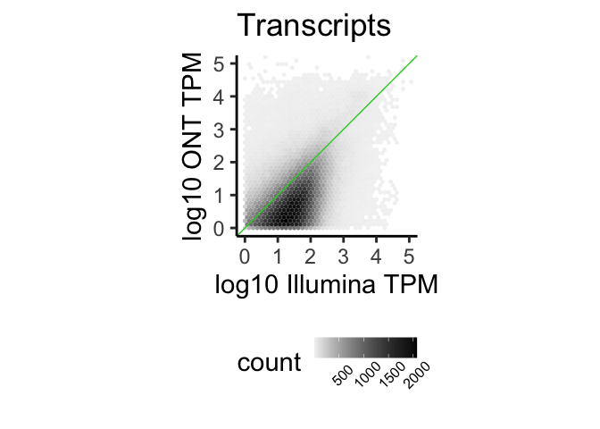
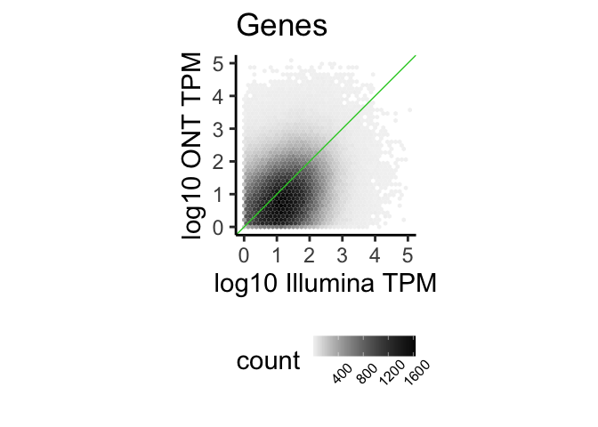

# BCB784-proj

Data analysis is distributed amongst other R scripts, some of which use
the [box](https://github.com/klmr/box) package syntax to make R scripts
into reproducible modules (similar to python)

### Data Availability

Small files are stored in the `/data` directory.

Data files that are too large for github may be temporarily found via
[google
drive](https://drive.google.com/file/d/1kA661pwAmi0wLTlGC3YhXbE5J_nwMui2/view?usp=drive_link)

Source data may be found from the gtex portal with the [long
read](https://gtexportal.org/home/downloads/adult-gtex/long_read_data)
and [short
read](https://gtexportal.org/home/downloads/adult-gtex/bulk_tissue_expression)
data.

## loading data

``` r
box::use(
  # ensures packages are loaded and attached
  # if `plyxp` is not be available for the user, in which
  # case they should either upgrade their `BiocManager`
  # version to 3.20, or use `remotes::install_github("jtlandis/plyxp")`
  analysis/dependencies[...],
  # makes various datasets available
  analysis/datasets
)

# long read data
datasets$se_long
```

    # A RangedSummarizedExperiment-tibble Abstraction: 93,630 × 92
        .features .samples | counts | source type  score phase gene_id transcript_id
        <chr>     <chr>    |  <dbl> | <fct>  <fct> <dbl> <int> <chr>   <chr>        
      1 000187c4… GTEX-11… |      0 | FLAIR  tran…    NA    NA ENSG00… 000187c4-a48…
      2 00026598… GTEX-11… |      0 | FLAIR  tran…    NA    NA ENSG00… 00026598-307…
      3 0002a5e2… GTEX-11… |      1 | FLAIR  tran…    NA    NA ENSG00… 0002a5e2-f01…
      4 000339f1… GTEX-11… |      0 | FLAIR  tran…    NA    NA ENSG00… 000339f1-176…
      5 0003706a… GTEX-11… |     39 | FLAIR  tran…    NA    NA ENSG00… 0003706a-94a…
      …     …         …           …     …      …       …     …    …          …      
    n-4 fffa90eb… GTEX-WY… |      2 | FLAIR  tran…    NA    NA ENSG00… fffa90eb-bfc…
    n-3 fffabc59… GTEX-WY… |      1 | FLAIR  tran…    NA    NA ENSG00… fffabc59-08f…
    n-2 fffc8c18… GTEX-WY… |      0 | FLAIR  tran…    NA    NA ENSG00… fffc8c18-b61…
    n-1 fffd4120… GTEX-WY… |      2 | FLAIR  tran…    NA    NA ENSG00… fffd4120-f79…
    n   fffe94ff… GTEX-WY… |      0 | FLAIR  tran…    NA    NA ENSG00… fffe94ff-bd9…
    # ℹ n = 8,613,960
    # ℹ 25 more variables: exon_number <chr>, exons <CmprsGRL>, key <chr>, `` <>,
    #   sample_name <chr>, sample_id <chr>, date_of_sequencing <dbl>, tissue <chr>,
    #   protocol <chr>, mrna_rin <chr>, flush_buffer <chr>, amount_loaded_ng <dbl>,
    #   run_time <chr>, total_reads <dbl>, median_read_length <dbl>,
    #   median_read_quality <dbl>, aligned_reads <dbl>,
    #   median_read_length_align <dbl>, median_read_quality_aligned <dbl>,
    #   WGS <chr>, data_center <chr>, RNA_extraction_method <chr>, …

``` r
# short read data
datasets$se_short
```

    # A RangedSummarizedExperiment-tibble Abstraction: 136,588 × 674
        .features         .samples |   rsem | source type  score phase ID    gene_id
        <chr>             <chr>    |  <dbl> | <fct>  <fct> <dbl> <int> <chr> <chr>  
      1 ENST00000373020.8 GTEX-11… | 807.   | HAVANA tran…    NA    NA ENST… ENSG00…
      2 ENST00000494424.1 GTEX-11… |   0    | HAVANA tran…    NA    NA ENST… ENSG00…
      3 ENST00000496771.5 GTEX-11… |  16.5  | HAVANA tran…    NA    NA ENST… ENSG00…
      4 ENST00000612152.4 GTEX-11… |  51.0  | ENSEM… tran…    NA    NA ENST… ENSG00…
      5 ENST00000614008.4 GTEX-11… |   2.59 | ENSEM… tran…    NA    NA ENST… ENSG00…
      …         …             …          …       …     …       …     …   …      …   
    n-4 ENST00000639839.1 GTEX-ZV… |   0    | HAVANA tran…    NA    NA ENST… ENSG00…
    n-3 ENST00000640226.1 GTEX-ZV… |   0    | HAVANA tran…    NA    NA ENST… ENSG00…
    n-2 ENST00000381568.9 GTEX-ZV… |  17.6  | HAVANA tran…    NA    NA ENST… ENSG00…
    n-1 ENST00000622217.1 GTEX-ZV… |   0    | ENSEM… tran…    NA    NA ENST… ENSG00…
    n   ENST00000578292.1 GTEX-ZV… |   0    | ENSEM… tran…    NA    NA ENST… ENSG00…
    # ℹ n = 92,060,312
    # ℹ 21 more variables: gene_type <chr>, gene_name <chr>, level <chr>,
    #   havana_gene <chr>, Parent <CmprssCL>, transcript_id <chr>,
    #   transcript_type <chr>, transcript_name <chr>,
    #   transcript_support_level <chr>, tag <CmprssCL>, havana_transcript <chr>,
    #   exon_number <chr>, exon_id <chr>, ont <CmprssCL>, protein_id <chr>,
    #   ccdsid <chr>, exons <CmprsGRL>, `` <>, tissue_id <chr>, tissue <chr>,
    #   sample_name <chr>

### datasets annotations

Please see
[`analysis/datasets.R`](https://github.com/jtlandis/BCB784-proj/blob/justin-dev/analysis/datasets.R)
as most values exported are annotated there.

### Subsetting short read Samples

Please see
[`data/filter_short_read_bulk_RNAseq.R`](https://github.com/jtlandis/BCB784-proj/blob/justin-dev/data/filter_short_read_bulk_RNAseq.R)
for source code on subsetting large rna-seq samples.

## Data Summary

The GTEX short read data contains many different versions, the two most
recent being version 8 and version 10. Given that the [associated
paper](https://www.nature.com/articles/s41586-022-05035-y) stated they
used Gencode Version 26, we opted to use GTEX version 8. The long read
data only has one GTEX version available, version 9, which is not
annotated as to which Gencode version was used.

### Gencode Issues

``` r
long_trans <- rowData(datasets$se_long)$transcript_id
short_trans <- rowData(datasets$se_short)$transcript_id
common_trans <- intersect(long_trans, short_trans)

match_trans <- function(se, trans) {
  rr <- rowRanges(se)[match(common_trans, trans)]
  id <- rr$transcript_id
  mcols(rr) <- NULL
  mcols(rr)$id <- id
  rr
}

rr_long <- match_trans(se(datasets$se_long), long_trans)
rr_short <- match_trans(se(datasets$se_short), short_trans)

#confirm all transcript ids are identical
# sanity check
all(identical(rr_long$id, rr_short$id))
```

    [1] TRUE

``` r
# only ~2,500 transcripts of the ~19,000 are identical
table(ranges(rr_long)==ranges(rr_short))
```


    FALSE  TRUE 
    16893  2576 

## Figure Reproduction

From
[`analysis/fig1c.R`](https://github.com/jtlandis/BCB784-proj/blob/justin-dev/analysis/fig1c.R)

``` r
box::use(f1c = analysis/fig1c,
         ggplot2[...])

f1c$plot_figc(f1c$plot_data_transcripts) +
  ggtitle("Transcripts")
```



``` r
f1c$plot_figc(f1c$plot_data_genes) +
  ggtitle("Genes")
```


